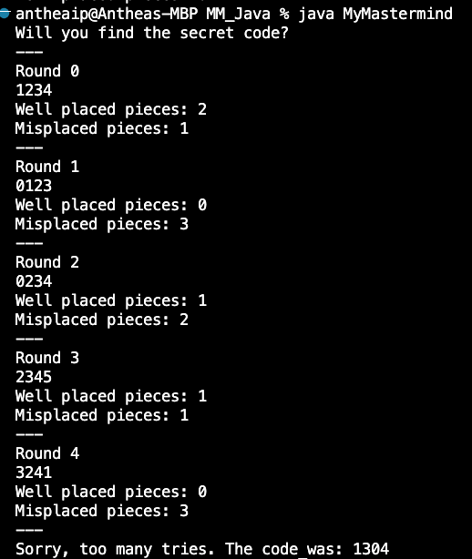
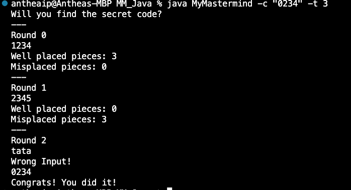
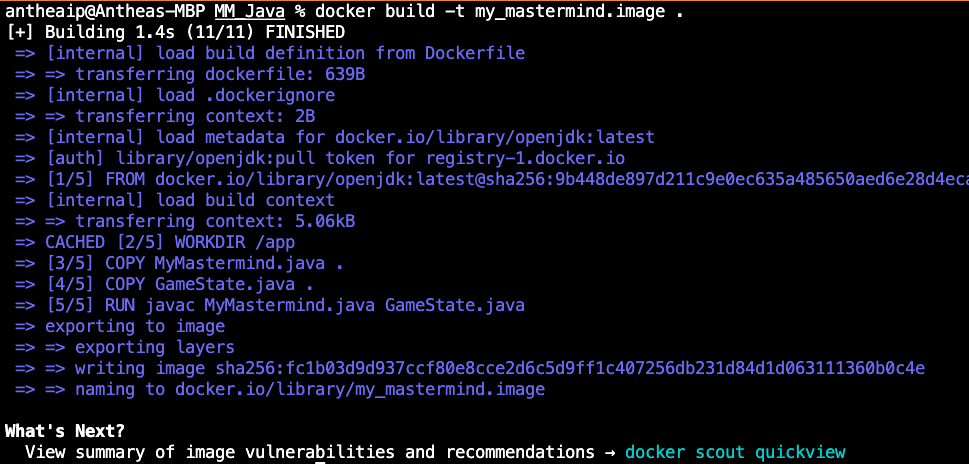
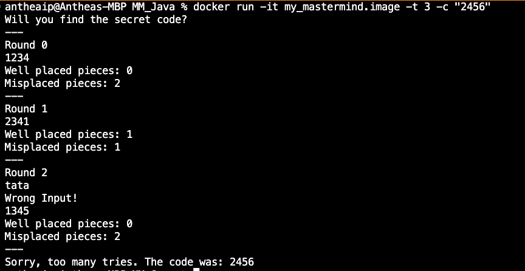

# Welcome to My Mastermind in Java
## Task
This is an implementation of the Mastermind number guessing game. The user plays against the program.

There are 8 pieces of different colors (but numbers in this case), and a secret code composed of 4 distinct pieces.

Typically, the user has 10 tries to guess the right pieces and sequence. After each guess, the user will be told the number of correctly placed pieces, and misplaced pieces. In this implementation, the user can enter a secret and/or the maximum number of tries.

## Design
I created this in Java, using Object Oriented Programming. I created a class Mastermind that holds the command-line inputs and user interactions. It is the entry point for the program. When the program is invoked (i.e.: `java MyMastermind -c "0234" -t 15`), the main method in the MyMastermind class is executed.

In the main method of "MyMastermind" class, I declare a variable "gameState" of type "GameState". This object accesses the methods and properties defined in the "GameState" class. This will manage the game functionality (eg increment the round, calculate well-placed and misplaced pieces, etc.).

I've also added Dockerfile to allowa a user to run my application on any system that supports Docker.

I've also added a .gitignore file to prevent certain files from being committed to the git repository. This will help keep the repository clean and focused.

## To run
### Command line:
First compile:  `javac MyMastermind.java GameState.java`  
Run file with default values:  `java MyMastermind` 
  

 

Run file with flags (input secret and/or tries):  `java MyMastermind -c "0234" -t 3` 
  

 

### Via Docker:
First compile image:  `docker build -t my_mastermind.image .`  
  

 

Run file with default vals:  `docker run -it my_mastermind.image`  
(NOTE: Flag -it will allow the scanner input of the guess)  
Press 'Enter' after entering each guess  

 
Run file with flags (input secret and/or tries): 
(NOTE: Flag -it will allow the scanner input of the guess)  
 `docker run -it my_mastermind.image -t 3 -c "2456"`  
Press 'Enter' after entering each guess  
  

 

## Installation
The addition of Docker should allow a user to run my application on any system that supports Docker.

## Game Rules
The Mastermind game requires the user to guess the secret code composed of four distinct pieces. After each guess, the user will be informed of the number of correctly placed pieces and the number of misplaced pieces. The objective is to guess the secret code in the fewest attempts possible.

